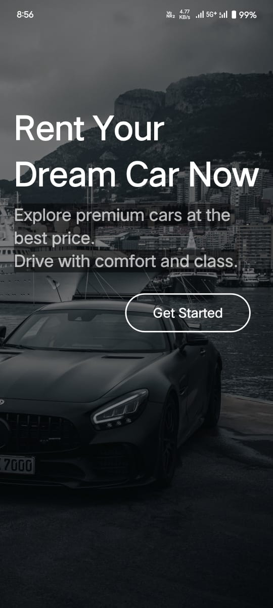

# 🚗 Car Rental App - RentCarLe

A full-featured Car Rental mobile application built using **Flutter**, with a robust backend powered by **Node.js** and **Firebase**. This project combines beautiful UI with real-world functionalities such as car booking, email confirmations, and map integration.

---

## ✨ Features

- 🔍 Browse cars with images, names, and types
- 📅 Book a car with pickup and return date
- 📍 Google Maps integration for location and navigation
- ✅ Booking confirmation via email (Nodemailer + Node.js)
- 🧠 State management using BLoC
- 🔐 Firebase integration (Authentication & Firestore)

---

## 📱 Frontend Tech Stack

| Tech       | Description                           |
|------------|---------------------------------------|
| Flutter    | Cross-platform UI development         |
| Dart       | Programming language for Flutter      |
| Firebase   | Backend-as-a-Service (BaaS)           |
| BLoC       | Predictable state management          |
| Google Maps | Location tracking and navigation     |

---

## 🛠️ Backend Tech Stack

| Tech         | Description                                      |
|--------------|--------------------------------------------------|
| Node.js      | JavaScript runtime for backend logic             |
| Express.js   | Lightweight server framework                     |
| Nodemailer   | For sending emails on booking confirmation       |
| EmailJS      | (Optional) Alternative for email sending         |
| Firebase     | Database + Auth (if used in backend logic)       |

---

## 📦 Packages & Libraries

### Flutter:
- `bloc`
- `flutter_bloc`
- `firebase_core`, `firebase_auth`, `cloud_firestore`
- `google_maps_flutter`
- `http`
- `fluttertoast`

### Node.js:
- `express`
- `nodemailer`
- `cors`
- `dotenv`

---

##  Screenshots

